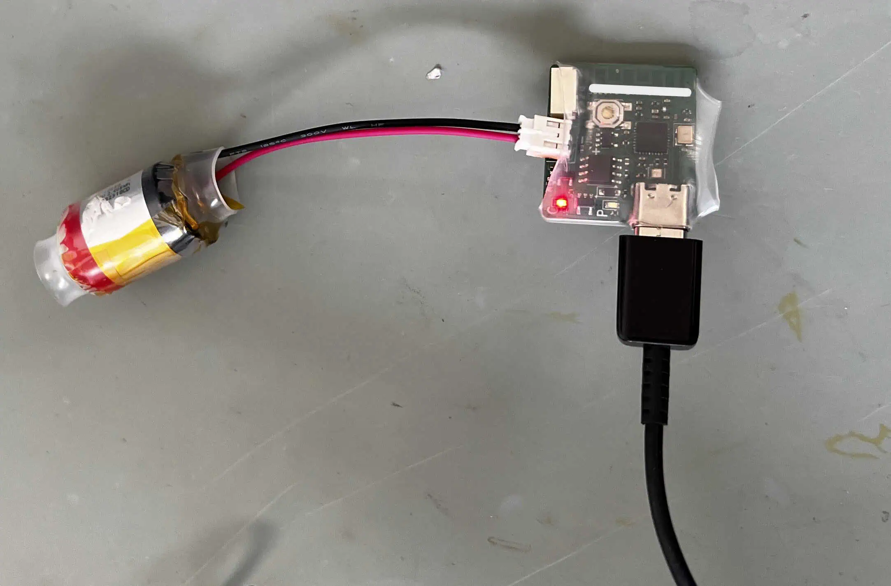
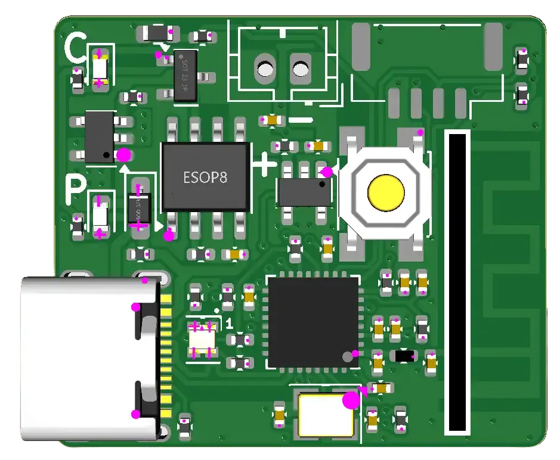
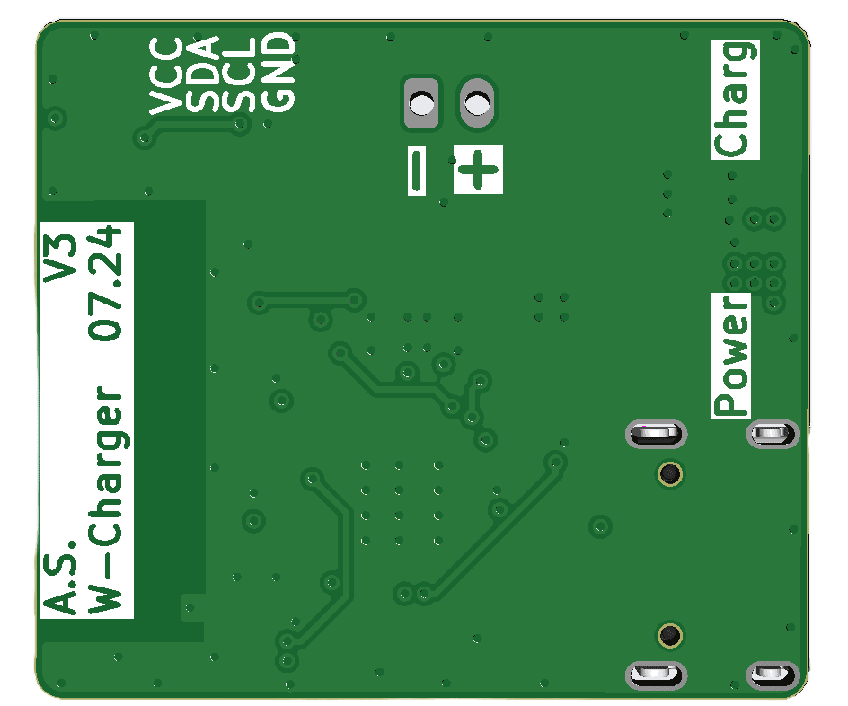

<div align="center">

# 🔋 lil-ESP32-C3

### Compact ESP32-C3 IoT Board with Sustainable Battery Recycling



[](https://opensource.org/licenses/MIT)
[](https://www.espressif.com/en/products/socs/esp32-c3)
[](https://platformio.org/)

**[Features](#-key-features)** • 
**[Hardware](#-hardware)** • 
**[Software](#-software-architecture)** • 
**[Getting Started](#-getting-started)** • 
**[Documentation](#-project-structure)**

---

</div>

## 📖 Overview

A complete open-source hardware and software solution for building **ultra-low-power IoT sensor networks** using the ESP32-C3 microcontroller. This project transforms discarded vape batteries into sustainable power sources for distributed environmental monitoring systems.

### 🎯 Key Features

<table align="center">
<tr>
<td width="50%" valign="top">

**♻️ Sustainable & Eco-Friendly**
- Recycle discarded vape batteries
- Prevent e-waste, extend battery life
- Second life for 300-900mAh LiPo cells

**📡 Ultra-Low Power Design**
- ESP-NOW wireless protocol
- Deep sleep: ~10µA consumption
- 12+ months on single charge

</td>
<td width="50%" valign="top">

**🌡️ Environmental Monitoring**
- BME280/BME680 sensor support
- Temperature, humidity, pressure, IAQ
- I2C interface for easy expansion

**☁️ Cloud Connected**
- ThingSpeak integration
- Real-time data visualization
- Multi-sensor aggregation

</td>
</tr>
</table>

---

## 💡 Use Case

<div align="center">


</div>

<br>

The system architecture consists of **distributed sensor nodes** placed throughout your environment, communicating via ESP-NOW to a **central hub** that aggregates and uploads data to the cloud.

```
┌─────────────┐     ESP-NOW      ┌──────────────┐      WiFi       ┌────────────┐
│ Sensor Node │ ─────────────────→│  Home        │ ───────────────→│ ThingSpeak │
│ (Battery)   │                   │  Station     │                 │   Cloud    │
└─────────────┘                   │  (USB)       │                 └────────────┘
                                  └──────────────┘
       ↓                                ↑
  Deep Sleep                      Data Queue
  10 minutes                      Buffering
```

**Typical Deployment:**
- 🏠 **Living Room**: Temperature + Humidity monitoring
- 🛏️ **Bedroom**: Air quality (IAQ) tracking
- 🍳 **Kitchen**: VOC detection for cooking
- 🖥️ **Office**: Climate control optimization
- 📊 **Dashboard**: Real-time visualization on any device

---

## � Hardware

### Custom ESP32-C3 PCB Design - Version 3

<div align="center">

<table>
<tr>
<td align="center" width="50%">
<br>
<b>Front Side - Component Layout</b>
</td>
<td align="center" width="50%">
<br>
<b>Back Side - Ground Plane</b>
</td>
</tr>
</table>

</div>

<br>

<table align="center">
<tr>
<td width="60%" valign="top">

**Core Specifications:**

| Component | Specification |
|-----------|--------------|
| **MCU** | ESP32-C3 @ 160MHz (RISC-V) |
| **Wireless** | WiFi 4 (802.11 b/g/n) + BLE 5.0 |
| **Memory** | 400KB SRAM, 4MB Flash |
| **GPIO** | 22 programmable pins |
| **ADC** | 12-bit for battery monitoring |
| **Interface** | USB-C for power & programming |
| **PCB** | 4-layer design for EMI reduction |

</td>
<td width="40%" valign="top">

**Power System:**
- ✅ LiPo charging IC (100mA/1A)
- ✅ Power path controller
- ✅ 3.3V LDO regulator
- ✅ Battery protection circuit
- ✅ USB-C input (5V)
- ⚠️ No buck-boost converter

**Version 3 Improvements:**
- Enhanced ground plane
- Optimized power path
- Better thermal management

</td>
</tr>
</table>

**PCB Evolution:** Three design iterations available in `PCB/` directory with progressive improvements in power management, I2C connectivity, and EMI shielding.

### 🌡️ Supported Sensors

All sensors connect via **I2C interface** (SDA: GPIO5, SCL: GPIO4)

<table align="center">
<tr>
<td align="center" width="50%" valign="top">

**BME280**

*Climate Monitoring*

📊 Temperature ±1°C  
💧 Humidity ±3% RH  
🌡️ Pressure ±1 hPa  
⚡ Ultra-low power (~3.6µA)

<br>

Perfect for basic environmental monitoring

</td>
<td align="center" width="50%" valign="top">

**BME680**

*Air Quality Analysis*

📊 Temperature ±1°C  
💧 Humidity ±3% RH  
🌡️ Pressure ±1 hPa  
🌬️ **IAQ Index** (VOC detection)

<br>

Ideal for health-conscious monitoring

</td>
</tr>
</table>

<br>

**Why I2C?**
- Simple 2-wire interface (SDA + SCL)
- Multiple sensors on same bus
- Standardized protocol
- Minimal GPIO usage

---

## 🔋 Battery Technology

### Sustainable Power: Recycled Vape Batteries

<table align="center">
<tr>
<td width="50%" valign="top">

#### ✅ Advantages

- ♻️ **Environmental Impact**: Prevents e-waste
- 💰 **Cost-Effective**: Free or very cheap
- ⚡ **High Capacity**: 300-900mAh tested range
- 📦 **Compact Size**: Perfect for IoT devices
- 🔌 **Ready to Deploy**: Standard LiPo format

</td>
<td width="50%" valign="top">

#### ⚠️ Considerations

- Safety risk during extraction
- Unknown battery health/cycles
- Inconsistent capacity by brand
- No manufacturer warranty
- Requires voltage testing

</td>
</tr>
</table>

### 📊 Real-World Performance

<div align="center">

| Configuration | Result |
|--------------|--------|
| **Battery** | 550mAh (recycled vape) |
| **Sensor** | ESP32-C3 + BME280 |
| **Interval** | 10 minutes |
| **Runtime** | ⚡ **12+ months** without recharge |

</div>

> 💡 **Note:** Various battery capacities tested (300mAh - 900mAh) with proportional runtime results. Actual performance depends on battery condition and usage pattern.

#### Safety Guidelines

⚠️ **Important:** Always follow proper safety procedures
- Inspect for physical damage before use
- Test voltage (3.0-4.2V acceptable range)
- Never use swollen batteries
- Use protective equipment during extraction
- Dispose of damaged cells properly

---

## 🎛️ Power Management System

### Intelligent Power Architecture

<table align="center">
<tr>
<td width="50%" valign="top">

**Components:**

1️⃣ **USB-C Input**
   - 5V programming & charging
   - Automatic source detection

2️⃣ **Charging IC**
   - CC/CV LiPo charging
   - 100mA or 1A variants
   - 4.2V cutoff protection
   - LED status indicator

3️⃣ **Power Path Controller**
   - Seamless USB/battery switching
   - Load sharing capability
   - Back-feed prevention

4️⃣ **3.3V LDO Regulator**
   - Efficient voltage regulation
   - Low dropout design
   - Stable output for MCU

</td>
<td width="50%" valign="top">

**Protection Features:**

🛡️ Over-discharge protection  
🛡️ Over-current protection  
🛡️ Short-circuit protection  
🛡️ Temperature monitoring

<br>

**Performance:**

⚡ Deep sleep: ~10µA  
⚡ Active (sensing): ~80mA  
⚡ TX (ESP-NOW): ~120mA  
⚡ Duration: 2-3 sec/cycle

</td>
</tr>
</table>

### ⚠️ Design Trade-off: No Buck-Boost Converter

**Current Implementation (LDO only):**

| Aspect | Impact |
|--------|--------|
| ❌ Battery usable range | 4.2V → 3.3V only (~75% capacity) |
| ❌ Lost capacity | ~25% (below 3.3V unusable) |
| ✅ Circuit complexity | Simple, reliable |
| ✅ Cost | Lower BOM cost |
| ✅ Efficiency | High at normal voltage |
| ✅ Runtime | Still 12+ months achieved |

**Rationale:** The LDO-only design provides sufficient runtime for most use cases while keeping the design simple and cost-effective. Future versions may incorporate buck-boost for maximum battery utilization.

---

## 💻 Software Architecture

### Five Firmware Implementations for Different Use Cases

<table align="center">
<tr>
<td width="33%" valign="top">

#### 1️⃣ ESP32-Sensor
**BME280 Basic Node**

📍 `SW-VSCode/ESP32-Sensor/`

- Temperature, humidity, pressure
- 10-min deep sleep cycles
- ESP-NOW transmission
- 3-6 months battery life
- Configurable sensor ID

</td>
<td width="33%" valign="top">

#### 2️⃣ ESP32-Extra-Sensor
**BME680 Air Quality**

📍 `SW-VSCode/ESP32-Extra-Sensor/`

- IAQ (Indoor Air Quality)
- Multi-temp calibration
- Professional gas sensing
- ESP-NOW with retry
- 10-min deep sleep

</td>
<td width="33%" valign="top">

#### 3️⃣ ESP32-Home-Station
**Central Hub**

📍 `SW-VSCode/ESP32-Home-Station/`

- ESP-NOW receiver
- Data queue (20 readings)
- Dynamic WiFi
- FreeRTOS tasks
- ThingSpeak upload
- USB-powered

</td>
</tr>
<tr>
<td width="50%" valign="top">

#### 4️⃣ W-Charger-ThingSpeak-1A
**WiFi Monitor (1A)**

📍 `SW-VSCode/W-Charger-ThingSpeak-1A/`

- Direct WiFi (no ESP-NOW)
- Battery monitoring
- RSSI reporting
- 10-min upload interval
- Deep sleep
- 1A charging

</td>
<td width="50%" valign="top">

#### 5️⃣ W-Charger-ThingSpeak-100mA
**Low-Power WiFi**

📍 `SW-VSCode/W-Charger-ThingSpeak-100mA/`

- WiFiManager config
- Calibrated ADC
- ThingSpeak upload
- 100mA charging
- Deep sleep optimized

</td>
</tr>
</table>

---

## 🚀 Getting Started

### Prerequisites

<table align="center">
<tr>
<td width="50%" valign="top">

**🔧 Hardware Requirements**

- ✅ ESP32-C3 board (custom or dev board)
- ✅ Vape battery (3.7V LiPo, 300-900mAh)
- ✅ I2C sensor (BME280 or BME680)
- ✅ USB-C cable

</td>
<td width="50%" valign="top">

**💾 Software Requirements**

- ✅ [PlatformIO](https://platformio.org/) (recommended)
- ✅ [Git](https://git-scm.com/)
- ✅ [ThingSpeak](https://thingspeak.com/) account (free)
- ✅ Arduino IDE (alternative)

</td>
</tr>
</table>

### Quick Start Guide

#### Step 1: Clone Repository

```bash
git clone https://github.com/Ans1S/lil-ESP32-C3.git
cd lil-ESP32-C3
```

#### Step 2: Configure Credentials

Each project includes a `config.h.example` template:

```bash
cd SW-VSCode/ESP32-Sensor/src
cp config.h.example config.h
# Edit config.h with your WiFi/ThingSpeak credentials
```

#### Step 3: ThingSpeak Setup

1. Create free account at [thingspeak.com](https://thingspeak.com/)
2. Create new channel
3. Add fields:
   - Field 1: Temperature (°C)
   - Field 2: Humidity (%)
   - Field 3: Pressure/IAQ
   - Field 4: Battery (mV)
4. Copy **Channel ID** and **Write API Key**

#### Step 4: Get Receiver MAC Address

Flash this to your home station:

```cpp
#include <WiFi.h>
void setup() {
  Serial.begin(115200);
  WiFi.mode(WIFI_STA);
  Serial.println(WiFi.macAddress());
}
void loop() {}
```

#### Step 5: Build & Upload

**Using PlatformIO:**

```bash
cd SW-VSCode/ESP32-Sensor
pio run --target upload
pio device monitor
```

**Using Arduino IDE:**

1. Open `.ino` file from `SW-Arduino-IDE/`
2. Select board: "ESP32C3 Dev Module"
3. Select port
4. Upload

---

📚 **For detailed setup instructions, see [SETUP_GUIDE.md](SETUP_GUIDE.md)**

---

## 📁 Project Structure

```
lil-ESP32-C3/
│
├── 📂 PCB/                       # Hardware Design Files (KiCad)
│   ├── Version 1/                # Initial design
│   ├── Version 2/                # Enhanced I2C + protection
│   └── Version 3/                # Optimized power path
│
├── 📂 SW-VSCode/                 # PlatformIO Projects
│   ├── ESP32-Sensor/             # BME280 sensor node
│   ├── ESP32-Extra-Sensor/       # BME680 air quality node
│   ├── ESP32-Home-Station/       # Central hub + WiFi gateway
│   ├── W-Charger-ThingSpeak-1A/  # Standalone WiFi (1A)
│   └── W-Charger-ThingSpeak-100mA/ # Standalone WiFi (100mA)
│
├── 📂 SW-Arduino-IDE/            # Arduino IDE Projects (Legacy)
├── 📂 Datasheet/                 # Component Datasheets
├── 📂 Readme/                    # Documentation Images
│
├── 📄 .gitignore                 # Git ignore rules
├── 📄 LICENSE                    # MIT License
├── � SETUP_GUIDE.md             # Detailed setup instructions
└── 📄 README.md                  # This file
```

---

## 📊 Performance Metrics

<div align="center">

### Sensor Node (Battery-Powered)

| Metric | Value |
|--------|-------|
| ⏱️ **Active Time** | ~2-3 seconds per reading |
| 😴 **Sleep Time** | 1200 seconds (20 min, configurable) |
| 🔋 **Battery Life** | 3-12+ months (500mAh typical) |
| ⚡ **Deep Sleep Power** | ~10µA |
| 📡 **Active Power** | ~80mA (sensing) |
| 📤 **TX Power** | ~120mA (ESP-NOW) |

### Home Station (USB-Powered)

| Metric | Value |
|--------|-------|
| 📥 **ESP-NOW Listening** | ~80mA |
| 📶 **WiFi Upload** | ~120mA (brief) |
| 🔌 **Power Source** | USB 5V (always-on) |
| 💾 **Queue Capacity** | 20 readings |

</div>

---

## 🔐 Security & Privacy

> **🔒 This repository does NOT contain sensitive credentials.**

All WiFi passwords, API keys, and MAC addresses must be configured locally in `config.h` files, which are:

- ✅ Excluded via `.gitignore`
- ✅ Never committed to repository
- ✅ Documented via `config.h.example` templates

**Before pushing to GitHub:**
1. Verify `config.h` files are git-ignored
2. Only commit `config.h.example` templates
3. Never hardcode credentials in source files

---

## 🛠️ Troubleshooting

<details>
<summary><b>🔴 Sensor Node Not Sending Data</b></summary>

- Check battery voltage (> 3.0V)
- Verify I2C sensor connections (SDA/SCL)
- Confirm receiver MAC address in `config.h`
- Monitor serial output for error messages
- Test sensor with I2C scanner

</details>

<details>
<summary><b>🔴 Home Station Not Receiving</b></summary>

- Ensure ESP-NOW on same WiFi channel
- Verify MAC address matches sender config
- Check distance between devices (< 100m)
- Confirm station is powered and running
- Review serial logs for ESP-NOW errors

</details>

<details>
<summary><b>🔴 ThingSpeak Not Updating</b></summary>

- Verify API key and Channel ID correct
- Check WiFi connection status
- Respect 15-second minimum upload interval
- Monitor ThingSpeak rate limits
- Check network firewall settings

</details>

<details>
<summary><b>🔴 Battery Drains Quickly</b></summary>

- Verify deep sleep is working (check serial)
- Increase sleep interval in configuration
- Check for sensor power leakage
- Test battery capacity with multimeter
- Ensure proper power path operation

</details>

---

## 🤝 Contributing

We welcome contributions from the community! Here's how you can help:

<table align="center">
<tr>
<td width="50%" valign="top">

**Ways to Contribute:**

- 🐛 Report bugs via [Issues](https://github.com/Ans1S/lil-ESP32-C3/issues)
- 💡 Suggest new features
- 📝 Improve documentation
- 🔧 Submit pull requests
- ⭐ Star the project
- 📢 Share your builds

</td>
<td width="50%" valign="top">

**Development Areas:**

- 📐 PCB design improvements
- 💻 Code optimization
- 🔋 Power management
- 🌡️ New sensor support
- 🐛 Bug fixes
- 🌐 Translations

</td>
</tr>
</table>

**Contribution Process:**

1. Fork the repository
2. Create feature branch (`git checkout -b feature/AmazingFeature`)
3. Commit changes (`git commit -m 'Add AmazingFeature'`)
4. Push to branch (`git push origin feature/AmazingFeature`)
5. Open Pull Request

---

## 📄 License

This project is licensed under the **MIT License** - see the [LICENSE](LICENSE) file for details.

**Third-Party Components:**
- Component datasheets © respective manufacturers
- ThingSpeak © MathWorks
- ESP32-C3 © Espressif Systems

---

## 🙏 Acknowledgments

<div align="center">

**Special thanks to:**

[](https://www.espressif.com/)
[](https://www.bosch-sensortec.com/)
[](https://thingspeak.com/)

- **Espressif Systems** - ESP32-C3 platform and excellent documentation
- **Bosch Sensortec** - High-quality BME280/BME680 environmental sensors
- **MathWorks** - ThingSpeak IoT cloud platform
- **Open Source Community** - Libraries, tools, and inspiration
- **Contributors** - Everyone who has helped improve this project

</div>

---

<div align="center">

## 📧 Contact & Links

[](https://github.com/Ans1S/lil-ESP32-C3)
[](https://github.com/Ans1S/lil-ESP32-C3/issues)
[](LICENSE)

---

### ⭐ Star this project if you find it useful!

### ♻️ Made with sustainability in mind for a greener future

---

**Built with ❤️ using ESP32-C3 and recycled batteries**

[Back to Top ↑](#-lil-esp32-c3)

</div>
