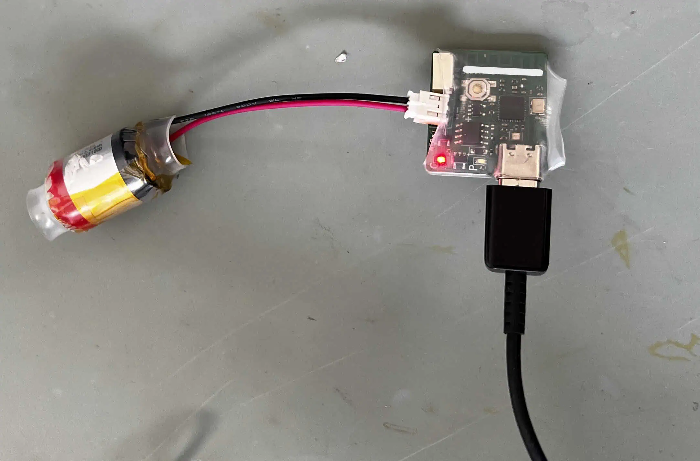
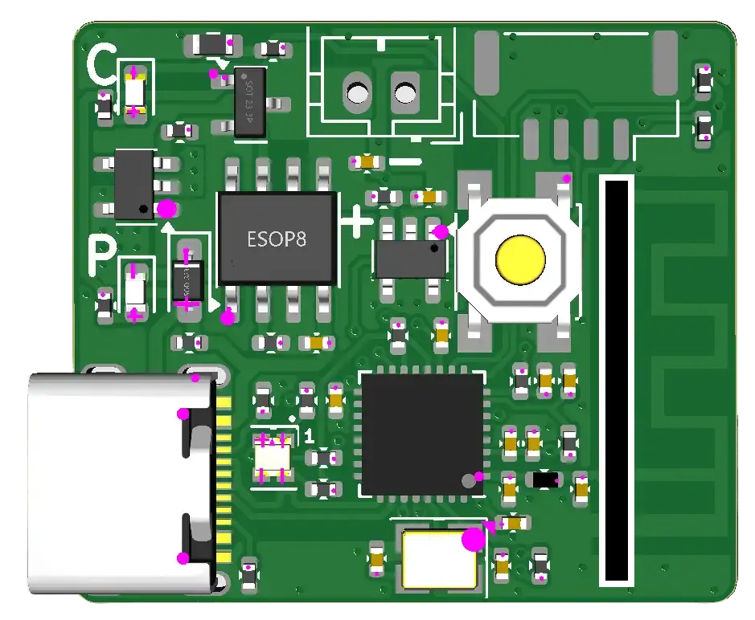
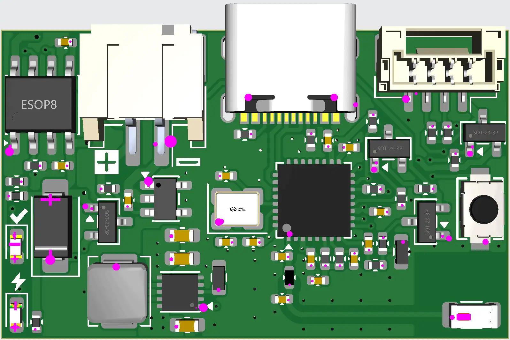
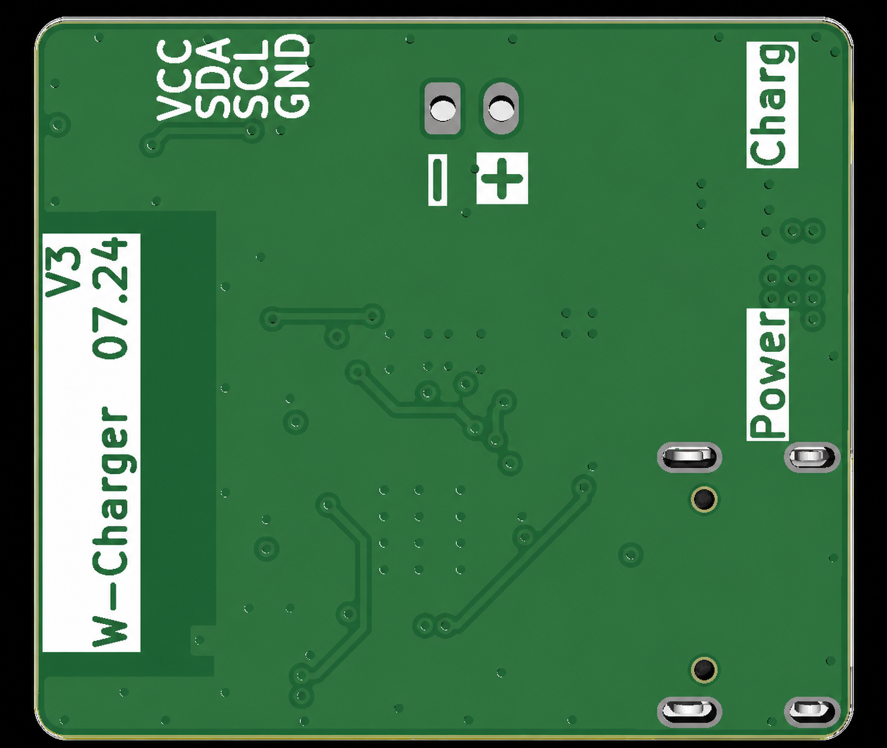
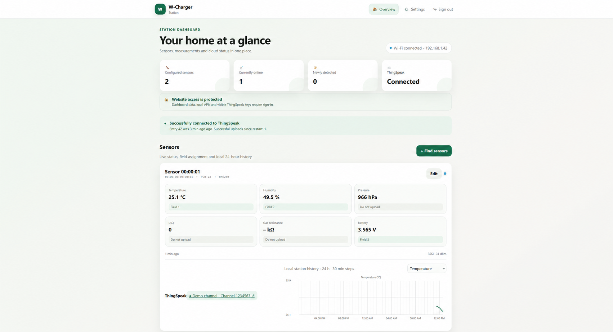
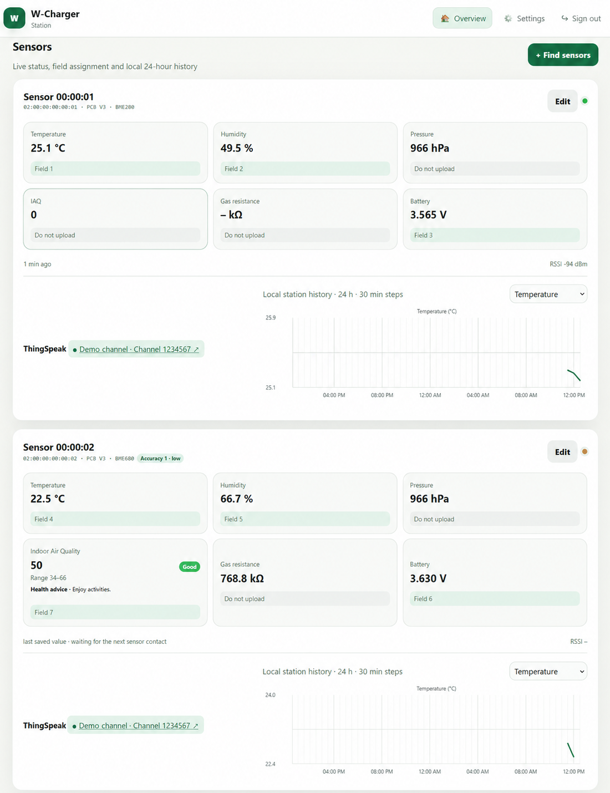

<div align="center">

# W-Charger

### Give disposable-vape batteries a second life as low-power sensor nodes



[](LICENSE)


**[Purpose](#why-w-charger)** · **[Hardware](#hardware)** ·
**[Software](#software)** · **[Upload](#upload-the-firmware)** ·
**[Security](#security-and-privacy)**

</div>

## Why W-Charger?

Disposable vapes often reach the waste stream while their small single-cell
lithium batteries can still store useful energy. W-Charger gives suitable,
carefully recovered cells a practical second life: they power compact
ESP32-C3 nodes that measure the environment instead of becoming immediate
electronic waste.

The goal is bigger than reusing one battery. This project makes a complete,
understandable sensor system available—from the PCB and low-power firmware to
automatic discovery, a local dashboard and optional cloud export. Connect a
BME280 or BME680, place multiple nodes around a room, and turn discarded energy
into useful temperature, humidity, pressure and air-quality data.

> [!CAUTION]
> Recovering lithium cells is not a beginner task. Never use swollen, punctured,
> corroded, hot or deeply discharged cells. Prevent short circuits, verify
> polarity and voltage before connection, and take damaged cells to an approved
> battery recycler. W-Charger is a prototype, not a certified consumer product.

## How it works

```text
Recovered 1-cell battery
          │
          ▼
ESP32-C3 sensor board + BME280/BME680
          │  ESP-NOW
          ▼
USB-powered ESP32-S3 station
          ├── Local responsive dashboard + 24 h history
          └── Optional HTTPS upload to ThingSpeak
```

| Part | Current implementation |
|---|---|
| Sensor node | Custom ESP32-C3 PCB V3 or V4, battery powered and mostly in deep sleep |
| Home station | Seeed Studio XIAO ESP32-S3, continuously powered by USB |
| Radio | ESP-NOW with automatic station and Wi-Fi-channel discovery |
| Sensors | BME280 or BME680 over I²C; operation without an environmental sensor is also possible |
| Configuration | Browser-based setup—no Wi-Fi password, MAC address or API key in source code |
| Data | Local readings and history; ThingSpeak is optional |

## Hardware

### PCB V3 and V4

PCB V4 is the current design. Its most important change is not cosmetic: the
power path now combines a buck-boost regulator with switchable sensor and
battery-measurement paths. This is intended to use more of the cell's discharge
range and reduce avoidable deep-sleep losses.

<table>
<tr>
<th align="center">PCB V3 · previous design</th>
<th align="center">PCB V4 · current design</th>
</tr>
<tr>
<td align="center"><br><sub>Front</sub></td>
<td align="center"><br><sub>Front</sub></td>
</tr>
<tr>
<td align="center"><br><sub>Back</sub></td>
<td align="center"><br><sub>Back</sub></td>
</tr>
</table>

| Focus | PCB V3 | **PCB V4** |
|---|---|---|
| 3.3 V supply | DS8561-33S5 LDO | TPS63900 buck-boost regulator |
| Usable battery range | Limited by LDO headroom | Designed to maintain 3.3 V across more of the Li-ion discharge curve |
| Sensor rail | GPIO10, active-high switching | PMOS power gate on GPIO10, active-low; sensor and I²C pull-ups are off during sleep |
| Battery measurement | ADC on GPIO3; divider remains connected | ADC on GPIO3 plus GPIO6 enable; divider is powered only for a reading |
| Battery connector | Earlier vertical connector layout | Low-profile, side-entry two-pin SMD connector |
| Charging/status | TC4056A-based layout | Revised TP4056 thermal-pad layout with clearer power/charge indicators |
| Firmware target | `sensor_pcb_v3` | `sensor_pcb_v4` |
| Status | Existing prototype | **Current prototype; complete electrical, thermal, RF and runtime validation is still required** |

Both revisions expose the same four-pin I²C interface:
`3V3 · SDA (GPIO5) · SCL (GPIO4) · GND`. The shared sensor firmware selects
the correct pin polarity and battery-measurement behavior through its build
profile.

The KiCad sources, BOM and production files are in [`PCB/`](PCB/). For V4,
the manufacturing package is under
[`PCB/Version 4/ESP32-C3-V4/production/`](PCB/Version%204/ESP32-C3-V4/production/).

## Software

There is one maintained firmware implementation under [`Firmware/`](Firmware/):

| Module | Role |
|---|---|
| [`station/`](Firmware/station/) | ESP32-S3 setup portal, local dashboard, sensor registry, history and optional ThingSpeak integration |
| [`sensor/`](Firmware/sensor/) | One ESP32-C3 codebase for PCB V3/V4 and BME280/BME680 |
| [`shared/`](Firmware/shared/) | Versioned ESP-NOW protocol shared by station and sensor |

Old experiments are intentionally excluded from Git. The `Firmware/`
directory is the single source of truth.

### Station dashboard

The station opens a browser-based setup flow on first boot. Afterwards the
overview shows connection state, discovered sensors, latest readings, battery
voltage, radio strength, ThingSpeak status and a local rolling 24-hour history.

<p align="center">

<br><sub>Station overview with anonymized demo identifiers.</sub>
</p>

Each sensor can be named and configured independently. Measurements can be
mapped to ThingSpeak fields 1–8 or kept local. BME680 nodes also show Static
IAQ, BSEC accuracy and gas resistance.

<p align="center">

<br><sub>Multiple sensor cards, local history and optional cloud field mapping. All device and channel identifiers are demo values.</sub>
</p>

Key behavior:

- New sensors discover the station automatically across all 13 ESP-NOW
  channels; no receiver MAC or channel is compiled into the sensor.
- BME280 nodes wake only for their configured measurement interval.
- BME680 nodes use Bosch BSEC2 in ULP mode. Internal measurements run every
  five minutes while radio reports follow the configured longer interval.
- Initial BME680 stabilization takes roughly 20 minutes; background learning
  continues afterwards.
- The station retains 48 local half-hour windows per sensor, creating a rolling
  24-hour history without an open browser or ThingSpeak.
- ThingSpeak channels and field mappings are optional and configured centrally
  in the station UI.

## Upload the firmware

### What you need

- VS Code with the PlatformIO IDE extension, or standalone PlatformIO Core
- Git and Python
- A USB data cable
- One connected board at a time

For the first USB upload, disconnect the recovered battery and power the board
from USB. Confirm the sensor PCB revision before flashing: V3 and V4 use
different power-control logic.

### Simplest method

Clone or download this repository, open a terminal in its root directory, then
run:

```bash
python Firmware/upload.py
```

Choose the connected station, V3 sensor or V4 sensor from the menu. The helper
finds a standard PlatformIO installation and runs the correct project and build
environment.

For a direct, repeatable command:

```bash
python Firmware/upload.py station
python Firmware/upload.py sensor-v4
# For an existing V3 board:
python Firmware/upload.py sensor-v3
```

On Windows, `py` can be used instead of `python`; on macOS or Linux the
command may be `python3`. If multiple serial devices are connected, add
`--port COM5` or the matching `/dev/...` device.

> [!IMPORTANT]
> Every station upload performs a full flash erase by design. Saved Wi-Fi
> settings, website password, ThingSpeak keys, sensors and local history are
> removed. Sensor firmware updates also start a fresh pairing state for a new
> firmware image.

<details>
<summary><strong>Upload with the PlatformIO button instead</strong></summary>

1. Open `Firmware/station` as a PlatformIO project.
2. Connect the ESP32-S3 station and select **PlatformIO: Upload**.
3. Open `Firmware/sensor` as a PlatformIO project.
4. Select `sensor_pcb_v3` or `sensor_pcb_v4` in the PlatformIO environment
   selector, connect the matching ESP32-C3 board and choose **Upload**.

</details>

<details>
<summary><strong>If no upload port is found</strong></summary>

- Confirm that the cable supports data, not charging only.
- Disconnect other ESP boards or pass `--port` explicitly.
- Put the board into download mode: hold **BOOT**, tap **RESET** (or reconnect
  USB), then release **BOOT** when the upload begins.
- On Windows, a short clone path can avoid toolchain problems when long-path
  support is disabled.

</details>

All three release targets currently compile successfully:
`station_s3`, `sensor_pcb_v3` and `sensor_pcb_v4`.

### First start

1. Flash the station.
2. Join `W-Charger-XXXXXX` with the initial setup password
   `W-Charger-Setup`. This is a public bootstrap password, not a personal
   credential.
3. If the captive portal does not open, browse to
   [`http://192.168.4.1/`](http://192.168.4.1/). Select a 2.4 GHz home network,
   configure optional ThingSpeak access and set the recommended website
   password.
4. After the station joins the home network, open
   [`http://w-charger.local/`](http://w-charger.local/) or the LAN address
   shown during setup.
5. Flash and power the matching sensor board. Open **Find sensors**, name the
   detected node, select BME280/BME680 (or automatic detection), choose its
   interval and save.

No serial monitor and no source-code credential file are required. Firmware
updates are currently USB-only; OTA update slots are reserved but the OTA flow
is not implemented.

## Security and privacy

This repository is designed to be public:

- Wi-Fi passwords, website credentials and ThingSpeak API keys are never
  compiled into the firmware. They are entered in the station UI and stored in
  ESP32 NVS.
- Documentation screenshots use anonymized MAC addresses, local IPs, entry
  numbers and ThingSpeak channel IDs.
- Local credential files, build output, compiler databases, private keys,
  machine-local KiCad exports and the retired firmware tree are ignored.
- Optional Git hooks block common credential files and likely secrets before a
  commit or push:

  ```bash
  git config core.hooksPath .githooks
  ```

Set a station website password before using ThingSpeak. Without it, another
device on the same trusted LAN could view configuration and API keys. The local
dashboard uses HTTP, so its password protects access but does not encrypt local
traffic. ThingSpeak requests use HTTPS.

ESP-NOW packets currently have protocol versioning, length checks and CRC32,
but no per-device cryptographic authentication. Treat the current system as a
trusted-home-network prototype.

## Repository structure

```text
.
├── Firmware/
│   ├── station/        # ESP32-S3 station
│   ├── sensor/         # ESP32-C3 sensor, PCB V3 and V4
│   └── shared/         # Common ESP-NOW protocol
├── PCB/
│   ├── Version 1–3/    # Earlier hardware revisions
│   └── Version 4/      # Current KiCad and production files
├── Readme/             # Public documentation images
├── .githooks/          # Optional secret guards
├── .gitignore
├── LICENSE
└── README.md
```

Detailed references:

- [Firmware overview](Firmware/README.md)
- [Station behavior and security model](Firmware/station/README.md)
- [Sensor behavior, BME680 and hardware profiles](Firmware/sensor/README.md)
- [System architecture](Firmware/ARCHITECTURE.md)
- [Hardware test plan](Firmware/HARDWARE_TESTPLAN.md)

## License

Project-owned source and hardware files are released under the [MIT License](LICENSE).
The optional BME680 path downloads Bosch BSEC2 during the build; that dependency
is distributed under Bosch's separate BSEC license.
