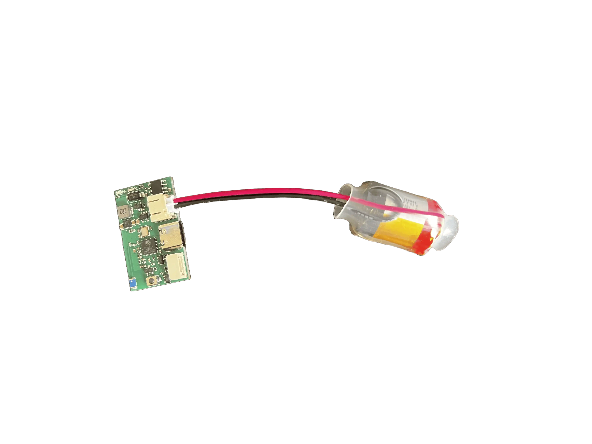
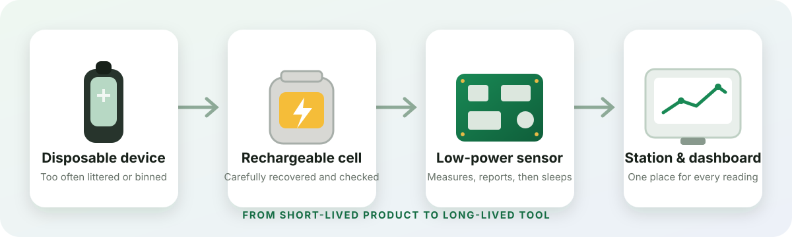
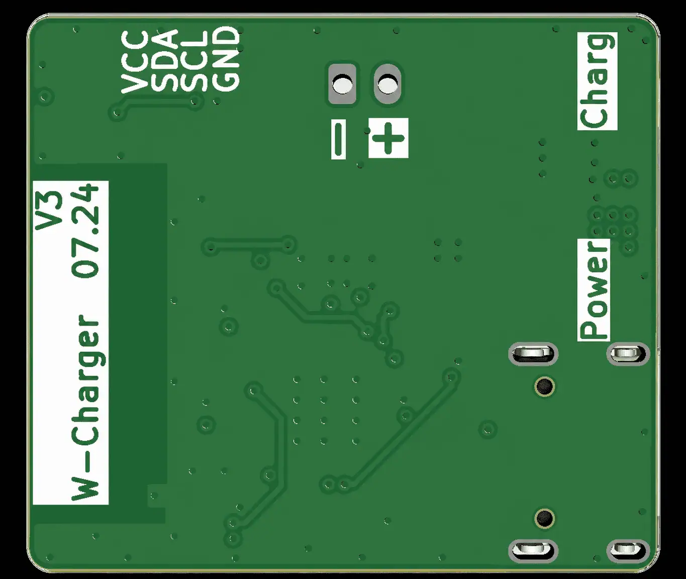
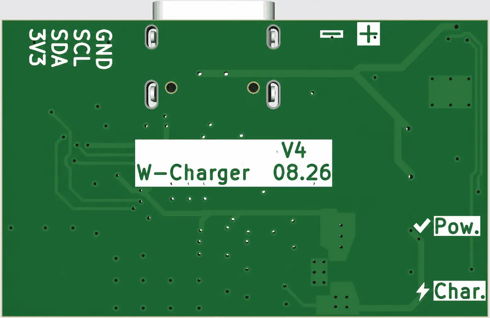
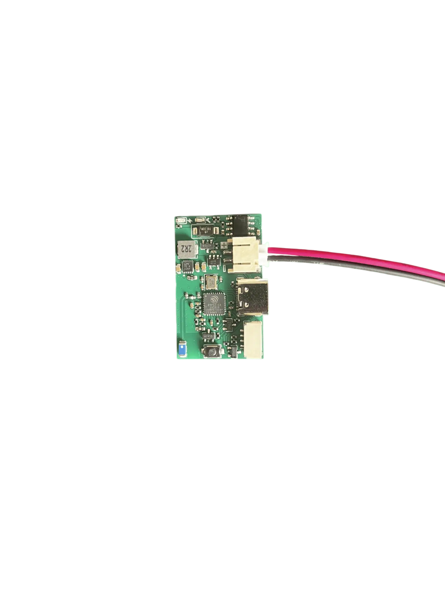
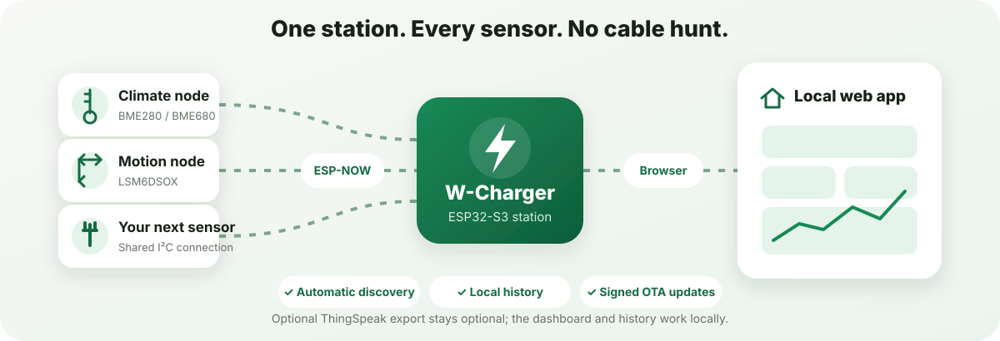
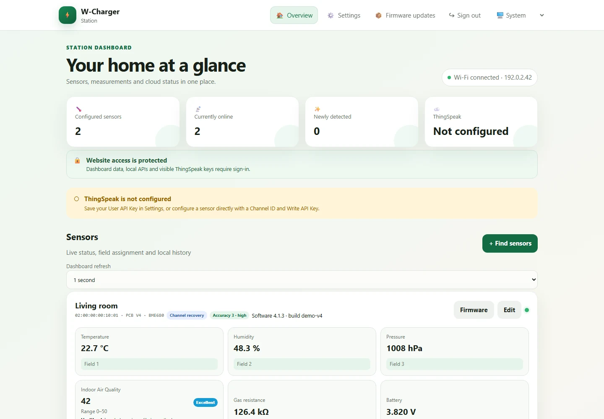
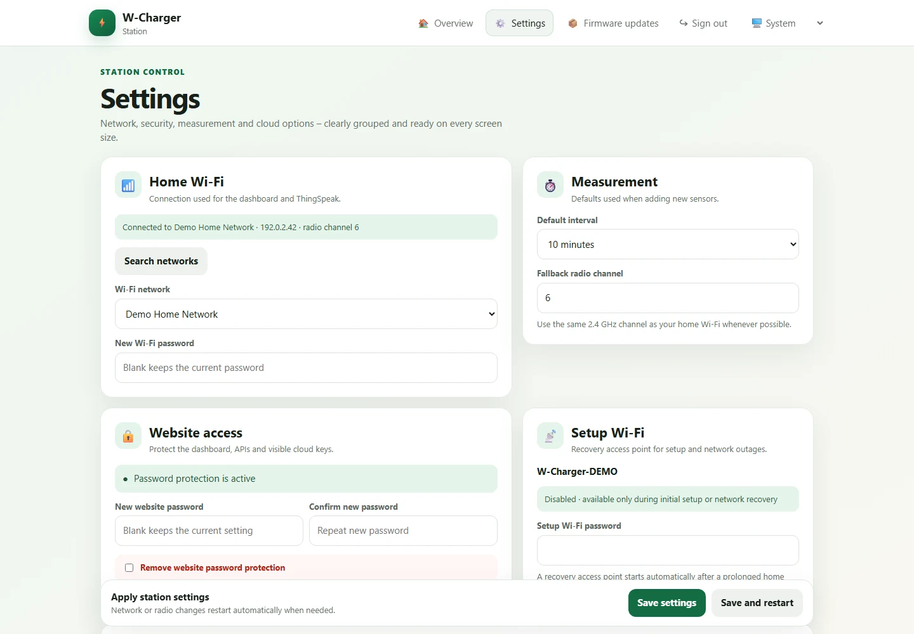
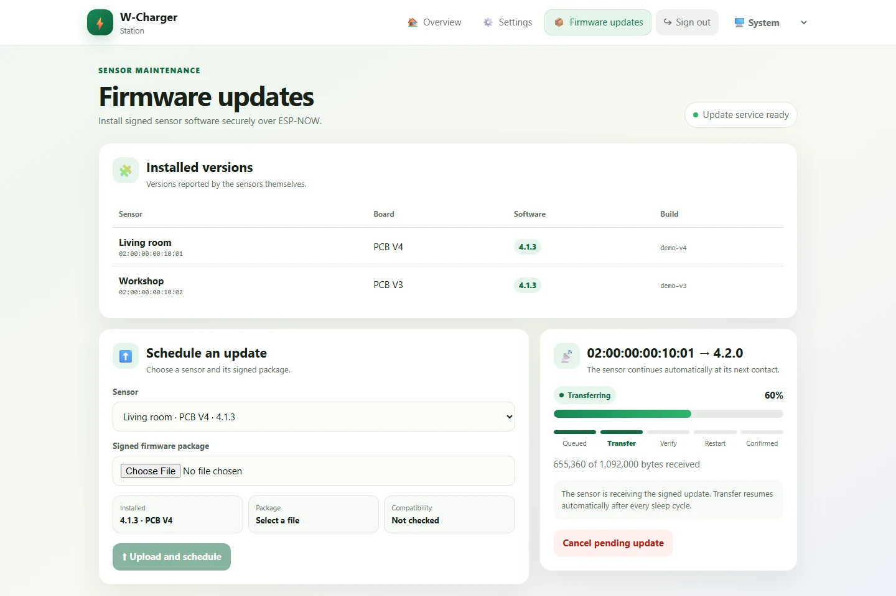

<div align="center">

# W-Charger

### Give a discarded vape battery a second life — as a useful, low-power sensor



<br>

[](LICENSE)


**[Why it matters](#1--why-it-matters)** · **[Hardware](#2--hardware-built-for-a-second-life)** · **[Software](#3--software-that-removes-the-friction)**

</div>

Disposable vapes are designed for a very short life. The rechargeable lithium
cell inside them often is not. W-Charger turns suitable recovered cells into
the power source for compact wireless sensor nodes — then makes the whole
network easy to see, configure and update from one station.

| ♻️ Give energy another job | 🔋 Make every milliamp count | 📡 See every sensor in one place | 📦 Update without collecting devices |
|---|---|---|---|
| Reuse a carefully recovered cell instead of wasting its remaining potential. | Deep sleep and switchable hardware are designed for even small cells. | A friendly local dashboard shows live values and history. | Signed OTA updates travel from the station to sleeping sensor nodes. |

## 1 — Why it matters

### A battery should not become waste with the package around it

Many disposable vapes end up in household bins or as litter. That throws away
valuable materials, creates a fire risk in waste handling, and can release
harmful substances when a damaged cell reaches the environment. At the same
time, the product enclosure gives its rechargeable cell no practical second
life for the user.

W-Charger starts with a simple idea: **if a safe, undamaged cell can still store
energy, use that energy for something worthwhile.** A sensor node is a good
match. It needs little power, can spend most of its time asleep, and can turn a
cell that once powered a short-lived product into months of useful
measurements, depending on the cell, sensor and reporting interval.

<p align="center">
  
</p>

This project is not only a charger or a PCB. It is the complete path from a
recovered energy source to an approachable sensor network:

- a purpose-built ESP32-C3 sensor board;
- support for environmental and motion sensors, with more sensor types planned;
- a central ESP32-S3 station that discovers nodes automatically;
- a responsive local web interface for readings, history and configuration;
- signed over-the-air firmware updates for the sensor fleet.

> [!CAUTION]
> **Recovering lithium cells is not a beginner task.** Never use a swollen,
> punctured, corroded, hot, leaking or deeply discharged cell. Prevent short
> circuits, verify polarity and voltage before connection, and take questionable
> cells to an approved battery recycler. W-Charger is an experimental prototype,
> not a certified consumer product.

## 2 — Hardware built for a second life

### Two generations, one goal

PCB V3 proved the concept. PCB V4 is the current design and pushes the same idea
further: use more of the cell's available energy and waste less of it while the
sensor sleeps.

<table>
  <tr>
    <th align="center">PCB V3 · proven prototype</th>
    <th align="center">PCB V4 · current design</th>
  </tr>
  <tr>
    <td align="center"></td>
    <td align="center"></td>
  </tr>
  <tr>
    <td align="center"></td>
    <td align="center"></td>
  </tr>
</table>

| What changed | PCB V3 | **PCB V4** |
|---|---|---|
| Power delivery | Simple, dependable 3.3 V regulator | Buck-boost supply designed to use more of the cell's discharge range |
| Sleeping efficiently | The sensor rail can be switched | Sensor rail, I²C pull-ups and battery measurement are powered only when needed |
| Battery connection | Earlier upright connector layout | Low-profile side-entry connector |
| Charging feedback | Functional charging circuit | Revised layout with clearer power and charge indicators |
| Best fit | Existing builds and experiments | New builds and lowest-power development |

Both versions run the same sensor firmware, with a build profile that selects
the correct power behavior for the board. V4 remains a prototype and still
requires complete electrical, thermal, RF and long-term runtime validation.

### Connect the measurement your project needs

The board exposes one straightforward four-pin I²C connection. Today the
firmware supports:

| Sensor | What it adds | Typical behavior |
|---|---|---|
| **BME280** | Temperature, humidity and pressure | Wake, measure, report, sleep |
| **BME680** | Temperature, humidity, pressure, gas resistance and indoor-air-quality estimation | Ultra-low-power background learning with configurable reports |
| **LSM6DSOX** | Acceleration, angular rate and motion summaries | Continuous acquisition for motion projects |
| **No external sensor** | Battery-powered ESP32-C3 experimentation | A clean base for future extensions |

The hardware is intentionally open-ended: one compact node, different sensor
boards, and a growing firmware library instead of a separate product for every
measurement.

<p align="center">
  
  
</p>

KiCad sources, BOMs and manufacturing files are available in [`PCB/`](PCB/).
The current V4 production package is under
[`PCB/Version 4/ESP32-C3-V4/production/`](PCB/Version%204/ESP32-C3-V4/production/).

## 3 — Software that removes the friction

### One station instead of a pile of USB cables

The station is the calm center of the system. Sensor nodes discover it over
ESP-NOW, send their readings, and return to their energy-saving routine. You
open one local website to see the whole network.

<p align="center">
  
</p>

There is no receiver address or Wi-Fi channel to hard-code into every sensor.
The station can find new nodes, name them, select their attached sensor,
configure their measurement interval, keep local history, and optionally map
values to ThingSpeak.

### A dashboard made for people, not only developers

<p align="center">
  
  <br><sub>Live status, battery level, air quality, radio strength and local history. All names, addresses and identifiers shown are synthetic demo data.</sub>
</p>

Every sensor card adapts to the connected hardware. A BME680 node can show
indoor air quality and gas resistance; a motion node exposes acceleration and
angular-rate views. Measurement intervals and cloud mappings stay configurable
per sensor, while useful defaults keep setup short.

### Settings stay visible and understandable

<p align="center">
  
  <br><sub>Network, energy, access and cloud options are grouped in one responsive interface. Credentials are blank in this generated demo.</sub>
</p>

The dashboard works locally. ThingSpeak export is optional. Wi-Fi passwords,
website credentials and API keys are entered in the browser and stored on the
station — they are not compiled into the source code.

### OTA updates: improve sensors where they are

Once a sensor has its OTA-capable base firmware, routine updates no longer mean
finding every node, opening its enclosure and connecting it to a computer.
Upload a signed firmware package to the station, choose a sensor, and the
transfer continues automatically whenever that sleeping node checks in.

<p align="center">
  
  <br><sub>The station checks board compatibility, tracks transfer progress and waits for the updated sensor to confirm a successful boot. Device addresses and build names are reserved demo values.</sub>
</p>

Interrupted transfers resume, low batteries can postpone an update, and the
previous image can be restored when a trial boot does not succeed. This turns a
collection of scattered devices into a sensor fleet that can keep improving.

### From clone to first measurement

You need VS Code with PlatformIO (or PlatformIO Core), Python, Git, a USB data
cable and one connected board at a time.

```bash
python Firmware/upload.py
```

The upload helper offers the station, PCB V3 sensor and PCB V4 sensor as clear
choices and uses the matching build automatically. Direct commands are also
available:

```bash
python Firmware/upload.py station
python Firmware/upload.py sensor-v4
# For an existing V3 board:
python Firmware/upload.py sensor-v3
```

Then:

1. Flash the ESP32-S3 station and join its `W-Charger-XXXXXX` setup network.
2. Follow the browser wizard to choose Wi-Fi, a sensible default interval and an optional website password.
3. Flash and power a matching sensor board.
4. Open **Find sensors**, give the node a name, choose its attached sensor and save.
5. From then on, use the station dashboard for readings, configuration and signed sensor updates.

> [!IMPORTANT]
> A station USB upload intentionally erases its complete flash. Saved Wi-Fi
> settings, website protection, cloud keys, registered sensors and local history
> are removed. Disconnect a recovered battery before the first USB upload and
> confirm whether the connected sensor PCB is V3 or V4.

<details>
<summary><strong>What the software already handles</strong></summary>

- Automatic station and Wi-Fi-channel discovery across all 13 ESP-NOW channels.
- Board-specific power control for PCB V3 and V4 from one sensor codebase.
- Energy-saving deep sleep for environmental sensors.
- BME680 operation with Bosch BSEC2 in ultra-low-power mode.
- Rolling local history and CSV export.
- Optional ThingSpeak channel management and field mapping.
- Responsive light, dark and system themes.
- Signed, resumable ESP-NOW OTA with compatibility checks and boot confirmation.

</details>

<details>
<summary><strong>Repository map and technical documentation</strong></summary>

```text
.
├── Firmware/
│   ├── station/        # ESP32-S3 station and local web app
│   ├── sensor/         # ESP32-C3 firmware for PCB V3 and V4
│   └── shared/         # Shared protocol and OTA components
├── PCB/
│   ├── Version 1–3/    # Earlier hardware revisions
│   └── Version 4/      # Current KiCad and production files
└── Readme/             # Documentation graphics and reproducible UI images
```

- [Firmware overview](Firmware/README.md)
- [Station behavior and security model](Firmware/station/README.md)
- [Sensor behavior and hardware profiles](Firmware/sensor/README.md)
- [OTA setup, signing and recovery](Firmware/OTA.md)
- [Power-management design](Firmware/POWER_MANAGEMENT.md)
- [System architecture](Firmware/ARCHITECTURE.md)
- [Hardware test plan](Firmware/HARDWARE_TESTPLAN.md)
- [LSM6DSOX motion guide](Firmware/LSM6DSOX.md)

The screenshots in this README are generated from the real embedded pages with
deterministic, anonymized fixtures. Rebuild them with
`node Readme/generate-ui-screenshots.cjs`; set `CODEX_NODE_MODULES` if
Playwright and Sharp are installed outside the default development runtime.

</details>

### Security, privacy and project status

The dashboard is intended for a trusted home network. Website access can be
password protected, but the local UI uses HTTP; ThingSpeak requests use HTTPS.
ESP-NOW packets currently include versioning, length checks and CRC32, but not
per-device cryptographic authentication. Treat the system as a prototype, not
as a security boundary.

Current firmware targets are `station_s3`, `sensor_pcb_v3` and
`sensor_pcb_v4`. Project-owned firmware and hardware sources are released under
the [MIT License](LICENSE). The optional BME680 path downloads Bosch BSEC2
during the build and remains subject to Bosch's separate license.

<div align="center">

**A short-lived product can still become a long-lived tool.**

</div>
